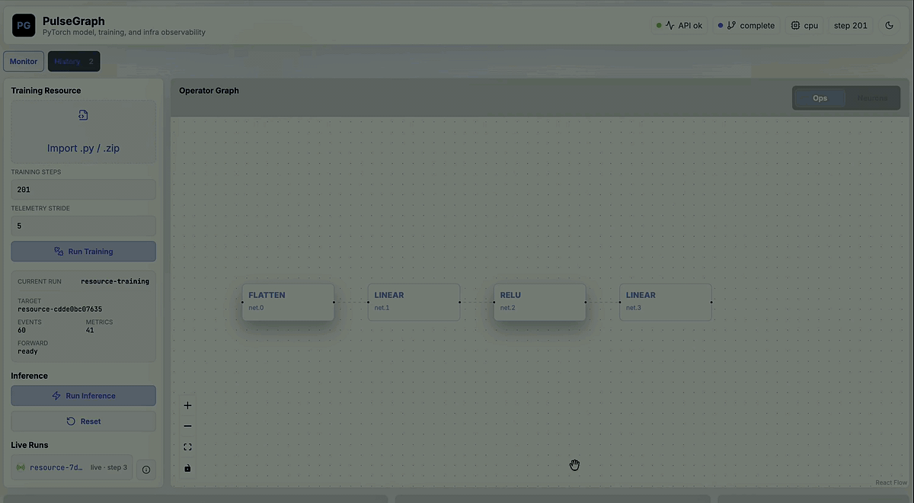

# PulseGraph

PulseGraph is a local-first PyTorch training observability workbench.

It turns a runnable Python training resource into a reproducible experiment record: model graph, training metrics, runtime events, checkpoints, probe samples, inference replay, and a lightweight diagnosis report.

## Demo Video

The first thing to watch is the local training and inference workflow:

[](docs/assets/pulsegraph-demo.mp4)

Click the preview to open the MP4 version:
[docs/assets/pulsegraph-demo.mp4](docs/assets/pulsegraph-demo.mp4)

## What PulseGraph Is

PulseGraph is not a generic cloud training platform. It is a controlled local platform for learning and validating PyTorch training workflows.

The core idea is simple:

1. Upload or select a trusted Python training resource.
2. Run training locally through a consistent backend contract.
3. Stream and persist training telemetry.
4. Visualize model structure, runtime events, metrics, samples, and inference output.
5. Reopen past runs from history for comparison, replay, and reporting.

This makes the project useful for PyTorch learning, model debugging, experiment explanation, and AI infrastructure practice.

## Main Workflow

```text
Python Training Resource
        |
        v
FastAPI controlled training runtime
        |
        v
Run archive: source + config + graph + metrics + events + checkpoints + samples
        |
        v
React dashboard: Operator Graph + Training Telemetry + Runtime Events + Recognition Result
        |
        v
History, replay, inference, and report
```

The dashboard currently focuses on one main user path:

- import `.py` or `.zip` training resource
- configure training steps and telemetry stride
- run training
- watch live graph and telemetry
- run inference repeatedly from the trained checkpoint
- inspect historical runs
- delete local run records when they are no longer needed

## Current Capabilities

- **Training Resource workflow**: accepts trusted Python source that defines a training resource contract, and can also adapt ordinary `nn.Module` MNIST-like model source.
- **Real training loop**: runs local PyTorch optimization on CPU and records loss, accuracy, step time, throughput, layer snapshots, and checkpoint metadata.
- **Telemetry stride**: separates training granularity from visualization granularity. For example, train 100 steps but record chart points every 5 steps.
- **Operator Graph**: traces model structure with `torch.fx` when possible, with tensor/state-dict fallback when tracing is unavailable.
- **Recognition Result**: shows inference output from real dataset samples, resource-provided samples, or synthetic probes without pretending all outputs are real recognition.
- **Runtime Events**: streams graph, metric, infra, layer snapshot, checkpoint, and completion events through SSE.
- **History**: persists runs locally, reopens recorded runs, and supports deleting local history records.
- **Reports**: builds a basic run report with metrics, checkpoint timeline, sample provenance, and rule-based diagnosis signals.

## Repository Layout

```text
backend/      FastAPI API, PyTorch runtime, event registry, run store, replay, reports
frontend/     React dashboard, graph view, telemetry charts, inference and history UI
client/       lightweight Python telemetry client for external training scripts
docs/         design notes, implementation plans, README media assets
Makefile      repeatable local commands for backend, frontend, tests, and build
```

The broader local learning workspace can keep model exercises and validation resources outside this Git repository, for example:

```text
/Users/tim/Documents/ai_infra/model_repo/
```

That separation keeps this repository focused on the platform layer while the model repository remains a place to learn PyTorch and validate training resources.

## Training Resource Contract

A training resource is a trusted Python file that exposes the pieces PulseGraph needs to run and visualize training:

```python
def metadata():
    return {
        "name": "mnist_mlp",
        "classes": 10,
        "input_shape": [1, 28, 28],
        "data_source": "mnist",
    }

def build_model():
    ...

def train_batch(step: int, batch_size: int):
    ...

def inference_sample(index: int):
    ...
```

For ordinary `nn.Module` files, PulseGraph can infer a simple MNIST-like resource when the model is compatible with `1 x 28 x 28` image inputs.

## Run Locally

Install backend dependencies:

```bash
cd /Users/tim/Documents/ai_infra/projects/pulsegraph
make install-backend
```

Install frontend dependencies:

```bash
cd /Users/tim/Documents/ai_infra/projects/pulsegraph
make install-frontend
```

Start backend:

```bash
cd /Users/tim/Documents/ai_infra/projects/pulsegraph
make backend
```

Start frontend:

```bash
cd /Users/tim/Documents/ai_infra/projects/pulsegraph
make frontend
```

Or start both during development:

```bash
cd /Users/tim/Documents/ai_infra/projects/pulsegraph
make dev
```

Open:

```text
http://127.0.0.1:5173
```

## Useful Commands

```bash
make backend         # FastAPI on 127.0.0.1:8010
make backend-reload  # FastAPI with reload
make frontend        # Vite frontend
make dev             # backend reload + frontend
make test            # backend tests + frontend tests
make build           # frontend production build
make health          # backend health check
```

## Verify

Backend tests:

```bash
cd /Users/tim/Documents/ai_infra/projects/pulsegraph
/opt/homebrew/Caskroom/miniconda/base/condabin/mamba run -n ai_infra python -m pytest backend/tests
```

Frontend tests and build:

```bash
cd /Users/tim/Documents/ai_infra/projects/pulsegraph/frontend
npm test -- --run
npm run build
```

## Replace The Demo Recording

To replace the README video with a new `.mp4` recording:

```bash
cd /Users/tim/Documents/ai_infra/projects/pulsegraph
cp ~/Desktop/<your-recording>.mp4 docs/assets/pulsegraph-demo.mp4
```

For macOS `.mov` recordings, convert it to a GitHub-friendly MP4:

```bash
cd /Users/tim/Documents/ai_infra/projects/pulsegraph
ffmpeg -y -i ~/Desktop/<your-recording>.mov -c:v libx264 -preset veryfast -crf 24 -pix_fmt yuv420p -movflags +faststart docs/assets/pulsegraph-demo.mp4
```

Then commit the video together with the README:

```bash
git add README.md docs/assets/pulsegraph-demo.mp4 docs/assets/pulsegraph-demo.gif
git commit -m "Add PulseGraph demo video"
git push origin main
```

## Design Notes

- [PulseGraph product spec](docs/superpowers/specs/2026-07-08-pulsegraph-design.md)
- [PulseGraph MVP plan](docs/superpowers/plans/2026-07-08-pulsegraph-mvp.md)
